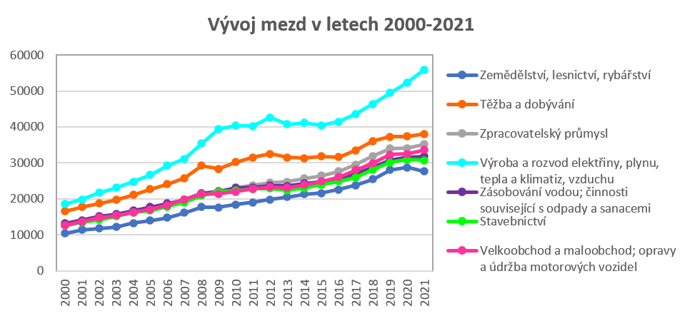
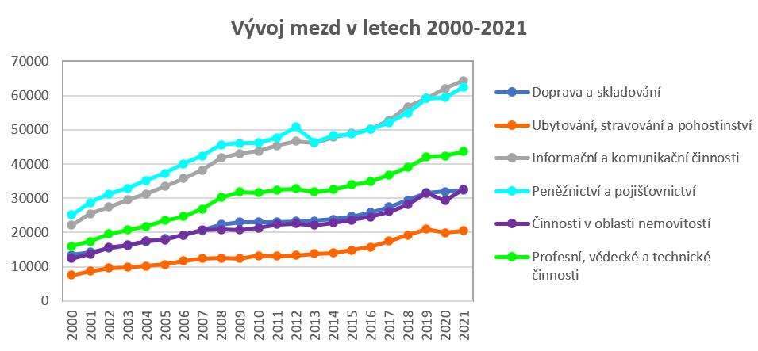
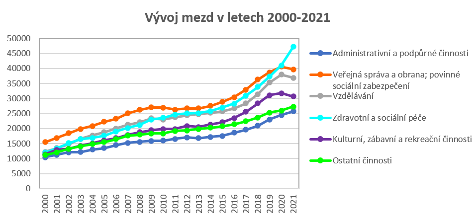
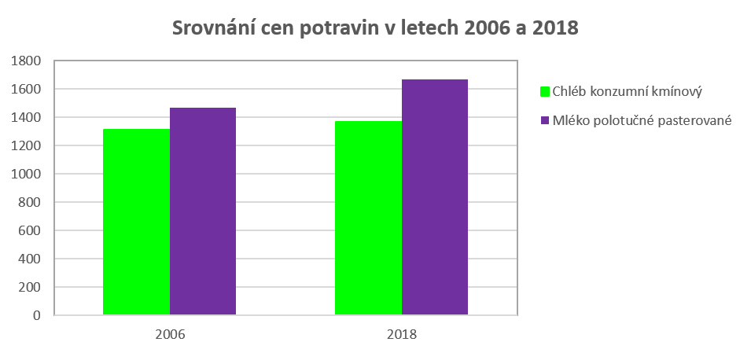

# Projekt z SQL: dostupnost potravin široké veřejnosti
Jedná se o první projekt v rámci Datové akademie od ENGETO.

## O projektu

Projekt je zaměřen na extrakci a analýzu dat týkajících se dostupnosti potravin široké veřejnosti. Byl zpracován a testován v databázovém systému PostgreSQL.

## Zadání projektu

- Z interní databáze, která obsahují data o cenách potravin, mzdách v různých pracovních odvětvích a základní informace (například HDP, populace aj.) o ČR a dalších státech*, je třeba vytvořit **2 vlastní tabulky**:
    - **primární tabulka** týkající se informací o mzdách a cenách potravin pro ČR za určité časové období
    - **sekundární** (dodatečná) **tabulka** obsahující HDP, GINI koeficient a populaci dalších evropských států pro stejné období
-  K primární tabulce je následně nutno vytvořit SQL skripty s dotazy, které pomohou odpovědět na **5 výzkumných otázek**:
    1. Rostou v průběhu let mzdy ve všech odvětvích, nebo v některých klesají?
    2. Kolik je možné si koupit litrů mléka a kolik kilogramů chleba za první a poslední srovnatelné období v dostupných datech cen a mezd?
    3. Která kategorie potravin zdražuje nejpomaleji (je u ní nejnižší percentuální meziroční nárůst)?
    4. Existuje rok, ve kterém byl meziroční nárůst cen potravin výrazně vyšší než růst mezd (vyšší než 10 %)?
    5. Má výška HDP vliv na změny ve mzdách a cenách potravin? Neboli, pokud vzroste HDP výrazněji v jednom roce, projeví se to na cenách potravin či mzdách ve stejném nebo následujícím roce výraznějším růstem?

\* data z interní databáze pocházejí z Portálu otevřených dat ČR

## Řešení projektu

Celkem bylo vytvořeno 7 SQL skriptů: 2 skripty pro vygenerování primární a sekundární tabulky a 5 skriptů s dotazy pro zodpovězení výzkumných otázek.

### Primární tabulka

Primární tabulka `t_Milan_Angelis_project_SQL_primary_final` je z tabulek v interní databázi generována ve skriptu `Project_sql_primary_table.sql` a obsahuje obecně tři typy dat:

* informace o cenách základních kategorií potravin za časové období 2006 až 2018,
* informace o mzdách v jednotlivých odvětvích (označení A až S) za roky 2000 až 2021,
* výši HDP pro ČR za léta 1990 až 2020.

poznámka: informace o mzdách se týkají mezd přepočtených, aby se odstranil vliv částečných úvazků atd.

### Sekundární tabulka 

Sekundární tabulka `t_Milan_Angelis_project_SQL_secondary_final` je generována ve skriptu `Project_sql_secondary_table.sql` obsahuje informace o HDP, GINI koeficientu a populaci pro další evropské státy.

### Otázka č. 1

*Rostou v průběhu let mzdy ve všech odvětvích, nebo v některých klesají?*

Pro zodpovězení dané výzkumné otázky byl vytvořen skript `Project_sql_task_1.sql`. Data ukazují, že skutečně platí, že se v ČR v průběhu let 2000 až 2021 ve všech odvětvích mzdy kontinuálně zvyšují, což je graficky znázorněno na následujících obrázcích:





### Otázka č. 2

*Kolik je možné si koupit litrů mléka a kolik kilogramů chleba za první a poslední srovnatelné období v dostupných datech cen a mezd?*

Příslušný SQL skript je `Project_sql_task_2.sql`. Srovnání bylo provedeno pro roky 2006 a 2018, neboť pro toto období jsou k dispozici data o mzdách i cenách potravin. Z dat o mzdách v jednotlivých pracovních odvětvích byla vypočtena průměrná mzda za daný rok a ta byla následně vydělena cenou za 1 litr mléka či cenou za 1 kg chleba pro příslušný rok. Tím bylo zjištěno, že za průměrnou mzdu bylo v roce 2006 možno zakoupit 1466 litrů mléka či 1313 kg chleba, zatímco v roce 2018 1670 litrů mléka či 1365 kg chleba; je tedy zřejmé, že obě potraviny byly v posledním srovnatelném období dostupnější v porovnání s průměrnou mzdou.



### Otázka č. 3

*Která kategorie potravin zdražuje nejpomaleji (je u ní nejnižší percentuální meziroční nárůst)?*

Pro tuto výzkumnou otázku byl vytvořen skript `Project_sql_task_3.sql`. Pro každou kategorii potravin byl vypočten meziroční procentuální růst ceny jako:

$$
\text{Růst} = \frac{P_t}{P_{t-1}} \times 100 - 100
$$

kde *P<sub>t</sub>* je cena potraviny za současný rok,
*P<sub>t</sub>*<sub>-1</sub> je cena potraviny za minulý rok.

Následně byla takto získaná data zprůměrována pro každou kategorii potravin za celé sledované období (roky 2006 až 2018). Nejnižší průměrná procentuální změna ceny byla pozorována u **cukru krystalového** (-1,92 %). Pro srovnání pro každou kategorii potravin spočten medián procentuálního růstu, který byl rovněž nejnižší u cukru krystalového (-2,47 %); z dat tedy vyplývá, že u této komodity existovala dokonce tendence k mírnému snižování ceny.

### Otázka č. 4

*Existuje rok, ve kterém byl meziroční nárůst cen potravin výrazně vyšší než růst mezd (vyšší než 10 %)?*

Příslušný skript je `Project_sql_task_4.sql`. Tento úkol byl rozdělen na dvě podotázky:

#### Podotázka 1: obecné srovnání růstu cen potravin se mzdami

Pro první část úkolu byl proveden obecný přehled průměrného meziročního růstu cen potravin ve srovnání s růstem mezd za období 2006 až 2018.

Výpočet průměrného růstu cen potravin byl proveden prostým průměrem meziročních růstů jednotlivých kategorií potravin, protože nebyly k dispozici váhy pro vážený průměr, který by byl přesnější.
 Následně byly filtrovány roky, kde byly meziroční růsty mezd i potravin kladné, aby srovnání dávalo smysl (protože se zadání týkalo srovnání meziročních růstů a ne poklesů).

Touto analýzou bylo zjištěno, že v žádném z pozorovaných let průměrný meziroční růst cen potravin **nepřekročil** 10 % ve srovnání s meziročním růstem mezd.

#### Podotázka 2: srovnání růstu cen jednotlivých kategorií potravin se mzdami

V druhé části úkolu byly srovnány jednotlivé kategorie potravin za každý rok se mzdami v daném roce v období 2006 až 2018.

Tímto způsobem bylo možné zjistit, které konkrétní kategorie potravin rostly rychleji než mzdy, i když celkový průměr neukazoval dramatický nárůst.

Tato analýza ukázala, že existuje několik kategorií potravin, které vykázaly růst vyšší než 10 % oproti růstu mezd v průběhu let ve sledovaném období. Nejvíce kategorií potravin vykázalo růst oproti mezd v letech **2008** a **2010** (6 kategorií), z nichž v obou letech byl nejvyšší růst u  **pšeničné mouky hladké** (rozdíl 35,21 % (2008), respektive 28,14 % (2010)).

### Otázka č. 5

 *Má výška HDP vliv na změny ve mzdách a cenách potravin? Neboli, pokud vzroste HDP výrazněji v jednom roce, projeví se to na cenách potravin či mzdách ve stejném nebo následujícím roce výraznějším růstem?*

Pro tuto výzkumnou otázku byl vytvořen skript `Project_sql_task_5.sql`. Byla získána data o:

* meziročních procentuálních růstech HDP pro roky 1991 až 2020
* meziročních růstech cen potravin pro roky 2007 až 2018 (prostě zprůměrované přes jednotlivé kategorie, tedy údaje z podotázky č. 1 výzkumné otázky č. 4)
* meziročních procentuálních růstech mezd pro období 2001 až 2020

Takto získaná dato byla následně podrobena korelační analýze (viz následující oddíl).


#### Analýza vztahu mezi růstem HDP a mzdami/cenami potravin 

Pro zhodnocení vztahu mezi růstem HDP, meziročním růstem mezd a cen potravin byla provedena **korelační analýza**. Ta umožňuje posoudit, zda mezi dvěma proměnnými existuje vzájemná závislost a jak silná tato závislost je. Vzhledem k omezenému počtu dostupných dat je však výsledná analýza spíše orientační.

Analýza byla provedena v jazyce Python v prostředí Jupyter Notebooku, s využitím knihoven Pandas, Matplotlib a SciPy.

Podrobný postup, použitá metodika i výpočty jsou uvedeny v přiloženém notebooku `task_5_analysis_pandas`.

#### *Požadavky a postup správného spuštění Jupyter Notebooku*

* Použité technologie:
    - Python 3 (doporučená verze 3.13.2)
    - Jupyter Notebook
    - Pandas – práce s daty  
    - Matplotlib – vizualizace dat  
    - SciPy – statistické výpočty (korelační testy)  
* Soubor konkrétních požadavků (použité knihovny a jejich verze) je uveden v souboru `requirements.txt`. Je doporučeno vytvořit nové virtuální prostředí a následně spustit:
```
pip3 --version                      # Ověření verze správce balíčků
pip3 install -r requirements.txt    # Instalace potřebných knihoven
```
* Spuštění Jupyter Notebooku: V aktivním virtuálním prostředí se do příkazové řádky zadá:

```
jupyter notebook
```

- tímto je uživatel přesměrován na webové rozhraní, kde z nabídky souborů vybere `task_5_analysis.ipynb`.

#### Výsledky korelační analýzy

Z provedené orientační korelační analýzy vyplývá, že mezi růstem HDP a růstem mezd **existuje** pozitivní vztah, tedy že pokud HDP roste, rostou i mzdy. Tento vztah je patrnější **s ročním zpožděním**, což naznačuje, že změny v ekonomickém výkonu se do vývoje mezd promítají až v následujícím roce.

Naopak mezi růstem HDP a růstem cen potravin **nebyl zjištěn** výrazný vztah.
Vzhledem k omezenému počtu dostupných dat je vhodné považovat výsledky za **orientační**; absence prokázané korelace může být částečně způsobena i **malým rozsahem** datového souboru, který snižuje spolehlivost statistického testu.